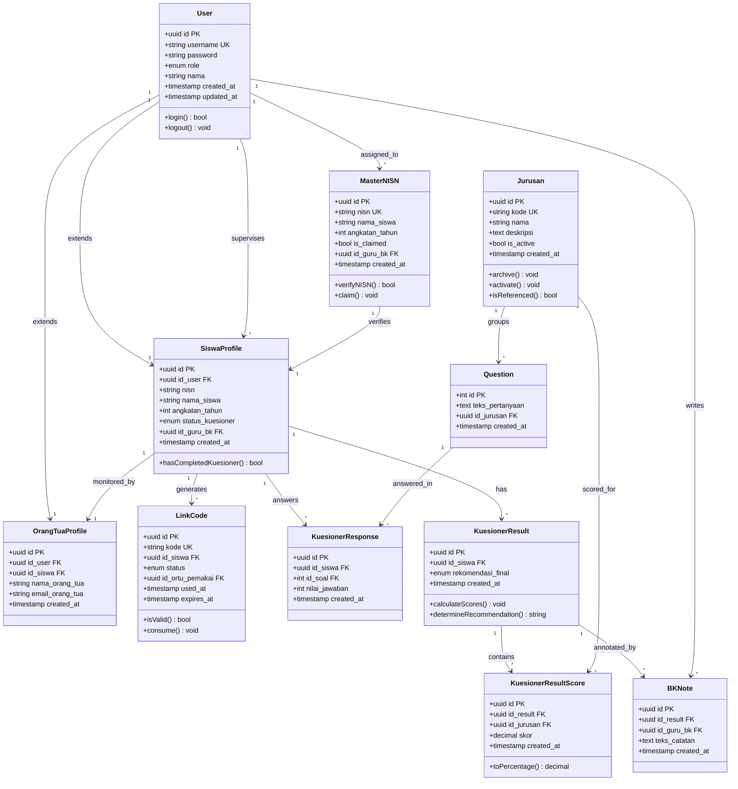

# Class Diagram — SAMI-SMK

Model data 11 entitas untuk aplikasi **SAMI-SMK (Sistem Analisis Minat Siswa SMK)**, memakai PostgreSQL melalui Supabase.

> Diagram di bawah ditulis dalam format **Mermaid**. Diagram akan tampil otomatis sebagai gambar saat berkas ini dibuka di GitHub atau editor Markdown yang mendukung Mermaid (mis. VS Code dengan ekstensi Mermaid).

## Diagram

## Keterangan Entitas

| Entitas | Kelompok | Deskripsi Singkat |
|---|---|---|
| User | Akun & pengguna | Akun seluruh peran (Siswa, Guru BK, Orang Tua, Admin). |
| MasterNISN | Akun & pengguna | Data master NISN resmi sekolah untuk verifikasi pendaftaran. |
| SiswaProfile | Akun & pengguna | Profil siswa, tertaut ke akun dan Guru BK pembimbing. |
| OrangTuaProfile | Akun & pengguna | Profil orang tua, tertaut 1:1 ke seorang siswa. |
| LinkCode | Akun & pengguna | Kode tautan sekali pakai untuk menautkan orang tua ke siswa. |
| Jurusan | Jurusan & penilaian | Jurusan dinamis yang dikelola Admin (jumlah tidak dibatasi). |
| Question | Jurusan & penilaian | Bank soal kuesioner; tiap soal terkait satu jurusan. |
| KuesionerResponse | Akun & pengguna | Jawaban siswa untuk tiap soal (skala Likert 1–5). |
| KuesionerResult | Akun & pengguna | Header hasil kuesioner beserta rekomendasi jurusan. |
| KuesionerResultScore | Jurusan & penilaian | Skor kecocokan per jurusan (0–100%) untuk sebuah hasil. |
| BKNote | Akun & pengguna | Catatan konseling Guru BK pada hasil kuesioner siswa. |

## Keterangan Notasi

- **PK** — Primary Key (kunci utama)
- **FK** — Foreign Key (kunci tamu / relasi antar-tabel)
- **UK** — Unique Key (nilai unik)
- Panah **1 → \***  menunjukkan relasi satu-ke-banyak.

Detail lengkap struktur, tipe data, constraint, index, dan skema SQL terdapat pada berkas `data_model.md`.
