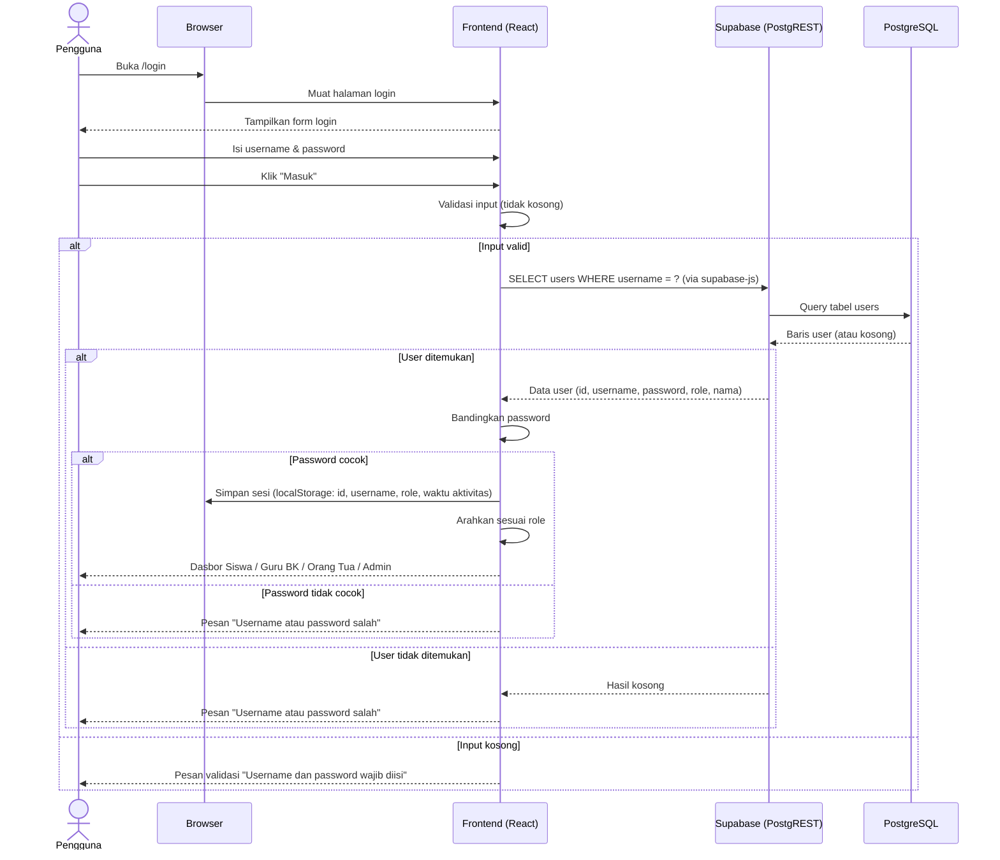

# System Logic: Autentikasi (Login & Sesi)

Document Version: v1.0

Scope: Prasyarat seluruh use case (F001 — Autentikasi & RBAC)

Catatan: Login bukan UC bernomor pada proyek ini; dokumen ini menjadi prasyarat UC-001 s/d UC-008.

Status: Draft

Last Updated: 2026-07-05

Project: SAMI-SMK — Sistem Analisis Minat Siswa SMK

---

## 1. Overview

Dokumen ini mendefinisikan logika sistem untuk autentikasi pengguna SAMI-SMK: alur proses, operasi basis data, alur data, aturan keamanan, dan ketertelusuran.

**Catatan arsitektur (penting):** SAMI-SMK adalah aplikasi *frontend-only* yang berkomunikasi langsung dengan Supabase (PostgreSQL + REST) memakai publishable/anon key. Tidak ada server API buatan sendiri. Karena itu, bagian "kontrak" di dokumen ini berisi **operasi Supabase** yang benar-benar dipakai aplikasi, bukan endpoint REST kustom.

Autentikasi bersifat **custom**: kredensial diverifikasi terhadap tabel `users` (bukan Supabase Auth bawaan).

---

## 2. Sequence Diagram



---

## 3. Operasi Sistem (Supabase)

### 3.1 Verifikasi Kredensial (Login)

Memeriksa username dan mengambil data pengguna untuk verifikasi.

**Operasi (supabase-js):**
```js
const { data, error } = await supabase
  .from('users')
  .select('id, username, password, role, nama')
  .eq('username', username)
  .maybeSingle();
```

**Setara REST:**
```
GET /rest/v1/users?select=id,username,password,role,nama&username=eq.{username}
```

**Hasil sukses (user ditemukan):**
```json
{
  "id": "0febdd22-f0a0-4deb-9260-c2501ce23eaf",
  "username": "fiky",
  "password": "<disimpan di kolom users.password>",
  "role": "siswa",
  "nama": null
}
```

**Hasil user tidak ditemukan:** `data = null` → aplikasi menampilkan "Username atau password salah."

**Penanganan galat:** setiap `error` dari Supabase dicatat ke console (`console.error`) dan pengguna diberi pesan umum tanpa membocorkan detail teknis.

---

### 3.2 Pembentukan Sesi (Client-side)

Tidak ada token dari server. Setelah verifikasi berhasil, frontend menyimpan sesi di `localStorage`:

```json
{
  "id": "uuid-pengguna",
  "username": "fiky",
  "role": "siswa",
  "nama": "Fiky Ramahdani",
  "lastActivity": 1751683200000
}
```

Sesi dipakai oleh komponen pelindung rute (route guard) untuk menentukan akses halaman berdasarkan `role`.

---

### 3.3 Pemeriksaan Sesi & Kedaluwarsa

Pada setiap pemuatan halaman dan aktivitas pengguna, frontend memeriksa sesi:

| Kondisi | Aksi Sistem |
| --- | --- |
| Sesi tidak ada | Alihkan ke `/login` |
| Sesi ada dan masih aktif | Perbarui `lastActivity`, izinkan akses sesuai role |
| Tidak ada aktivitas > 60 menit | Hapus sesi, alihkan ke `/login` dengan pesan sesi berakhir |
| Role tidak sesuai rute | Alihkan ke dasbor role yang bersangkutan |

---

### 3.4 Logout

```js
localStorage.removeItem('sami_session');
// arahkan ke /login
```

Tidak ada pemanggilan server; sesi murni client-side.

---

## 4. Data Flow

| Step | Input | Process | Output |
| --- | --- | --- | --- |
| 1 | Username, Password | Validasi form di frontend (tidak kosong) | Input tervalidasi |
| 2 | Username | Query tabel `users` ke Supabase | Data pengguna atau kosong |
| 3 | Password input vs `users.password` | Perbandingan kredensial di frontend | Cocok / tidak cocok |
| 4 | Data pengguna | Simpan sesi ke `localStorage` | Sesi aktif (id, role) |
| 5 | Role pada sesi | Route guard menentukan halaman | Akses dasbor sesuai peran |

---

## 5. Security Rules

### 5.1 Kondisi Saat Ini (apa adanya)

| Aspek | Kondisi | Catatan |
| --- | --- | --- |
| Penyimpanan password | Plain text pada kolom `users.password` | **Belum aman**; hanya layak untuk lingkungan belajar/prototipe |
| Verifikasi kredensial | Dilakukan di sisi frontend | Kredensial terbaca oleh klien |
| Penyimpanan sesi | `localStorage` (bukan HttpOnly cookie) | Rentan terhadap XSS |
| Kedaluwarsa sesi | 60 menit tanpa aktivitas | Sudah diterapkan |
| RLS Supabase | Permisif (`using (true)`) dengan anon key | Belum membatasi per pengguna |
| Rate limiting | Belum ada | Belum ada pembatasan percobaan login |
| Username | Unik, tidak membedakan huruf besar/kecil | Sudah diterapkan |
| Pesan galat | Umum ("Username atau password salah") | Tidak membocorkan apakah username ada |

### 5.2 Rekomendasi Pengembangan (belum diimplementasikan)

| Rekomendasi | Alasan |
| --- | --- |
| Hash password (mis. bcrypt, cost ≥ 12) | Password tidak boleh tersimpan/terbaca apa adanya |
| Pindahkan verifikasi ke sisi server (Edge Function/API) | Kredensial tidak diproses di klien |
| Perketat RLS per peran dan per kepemilikan data | Membatasi akses data antar-pengguna |
| Simpan sesi pada HttpOnly, Secure cookie | Mengurangi risiko pencurian sesi via XSS |
| Batasi percobaan login (rate limiting) | Mencegah percobaan brute force |

> Keterbatasan di atas disadari dan dicatat sebagai rencana pengembangan; aplikasi versi ini ditujukan untuk lingkup akademik, bukan data siswa sesungguhnya.

---

## 6. Traceability

| User Flow | Requirement | Operasi Sistem |
| --- | --- | --- |
| userflow_uc_001.md (registrasi siswa) | F001 (Autentikasi & RBAC) | SELECT `users` (verifikasi username) |
| userflow_uc_002.md (registrasi orang tua) | F001 | SELECT `users` |
| Seluruh alur berperan (UC-003 s/d UC-008) | F001 (prasyarat akses) | Route guard berbasis `role` pada sesi |
