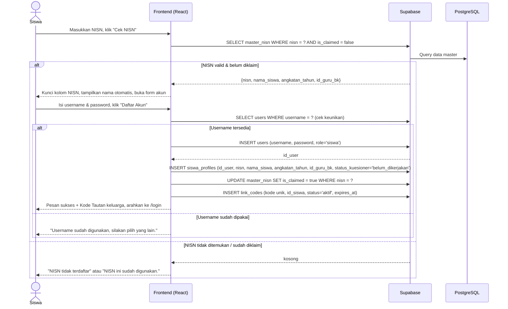

# System Logic: UC-001 Registrasi Mandiri Siswa Baru

Document Version: v1.0
Use Case ID: UC-001
Status: Draft
Last Updated: 2026-07-05
Project: SAMI-SMK

---

## 1. Overview
Logika sistem untuk pendaftaran akun siswa dengan verifikasi NISN terhadap data master sekolah. Aplikasi memanggil Supabase langsung dari frontend (tanpa server API kustom).

---

## 2. Sequence Diagram



---

## 3. Operasi Sistem (Supabase)

**3.1 Verifikasi NISN**
```js
await supabase.from('master_nisn')
  .select('nisn, nama_siswa, angkatan_tahun, id_guru_bk, is_claimed')
  .eq('nisn', nisn).maybeSingle();
```

**3.2 Cek keunikan username**
```js
await supabase.from('users').select('id').eq('username', username).maybeSingle();
```

**3.3 Buat akun & profil (berurutan, harus semua berhasil)**
```js
// 1) users
await supabase.from('users').insert({ username, password, role: 'siswa' }).select('id').single();
// 2) siswa_profiles (menyalin id_guru_bk dari master_nisn)
await supabase.from('siswa_profiles').insert({ id_user, nisn, nama_siswa, angkatan_tahun, id_guru_bk, status_kuesioner: 'belum_dikerjakan' });
// 3) tandai NISN terklaim
await supabase.from('master_nisn').update({ is_claimed: true }).eq('nisn', nisn);
// 4) kode tautan keluarga
await supabase.from('link_codes').insert({ kode, id_siswa, status: 'aktif', expires_at });
```

---

## 4. Data Flow
| Step | Input | Process | Output |
| --- | --- | --- | --- |
| 1 | NISN | Verifikasi ke `master_nisn` | Nama & angkatan & id_guru_bk |
| 2 | Username | Cek keunikan di `users` | Tersedia / tidak |
| 3 | Kredensial + data master | INSERT `users` → `siswa_profiles` | Akun siswa aktif |
| 4 | id_siswa | Tandai NISN terklaim, buat kode tautan | Kode Tautan keluarga |

---

## 5. Business & Integrity Rules
| Rule | Deskripsi |
| --- | --- |
| Verifikasi NISN | Hanya NISN yang ada di `master_nisn` dan `is_claimed = false` yang dapat mendaftar. |
| Nama read-only | Nama siswa diambil dari data master, tidak dapat diubah pendaftar. |
| Guru BK pembimbing | `id_guru_bk` disalin dari `master_nisn` ke `siswa_profiles` saat pendaftaran. |
| Username unik | Dicek sebelum insert; pesan galat jika duplikat. |
| Konsistensi | Bila salah satu insert gagal, langkah berikutnya dibatalkan dan pengguna diberi pesan galat (tanpa transaksi lintas-tabel karena keterbatasan klien). |

---

## 6. Traceability
| User Flow | Requirement | Operasi |
| --- | --- | --- |
| userflow_uc_001.md | F001, F002 | SELECT master_nisn; INSERT users, siswa_profiles, link_codes; UPDATE master_nisn |
