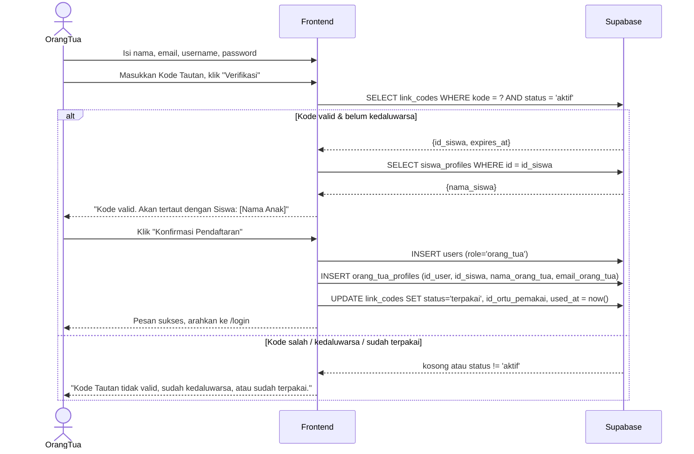

# System Logic: UC-002 Registrasi Mandiri Orang Tua

Document Version: v1.0
Use Case ID: UC-002
Status: Draft
Last Updated: 2026-07-05
Project: SAMI-SMK

---

## 1. Overview
Logika sistem untuk pendaftaran akun Orang Tua yang tertaut ke satu siswa melalui Kode Tautan sekali pakai (relasi 1:1).

---

## 2. Sequence Diagram



---

## 3. Operasi Sistem (Supabase)

**3.1 Verifikasi kode tautan**
```js
await supabase.from('link_codes')
  .select('id, id_siswa, status, expires_at')
  .eq('kode', kode).eq('status', 'aktif').maybeSingle();
// lalu bandingkan expires_at dengan waktu sekarang
```

**3.2 Buat akun orang tua & tautkan**
```js
await supabase.from('users').insert({ username, password, role: 'orang_tua' }).select('id').single();
await supabase.from('orang_tua_profiles').insert({ id_user, id_siswa, nama_orang_tua, email_orang_tua });
await supabase.from('link_codes').update({ status: 'terpakai', id_ortu_pemakai: id_user, used_at: new Date().toISOString() }).eq('kode', kode);
```

---

## 4. Data Flow
| Step | Input | Process | Output |
| --- | --- | --- | --- |
| 1 | Kode Tautan | Verifikasi status & kedaluwarsa | id_siswa (anak) |
| 2 | Data orang tua | INSERT `users` (role orang_tua) | id_user |
| 3 | id_user + id_siswa | INSERT `orang_tua_profiles` | Relasi 1:1 terkunci |
| 4 | Kode | UPDATE status → `terpakai` (audit: pemakai, waktu) | Kode tidak dapat dipakai lagi |

---

## 5. Business & Integrity Rules
| Rule | Deskripsi |
| --- | --- |
| Relasi 1:1 | Satu siswa maksimal satu akun orang tua. |
| Kode sekali pakai | Setelah dipakai, status `terpakai`; disimpan `id_ortu_pemakai` dan `used_at` untuk audit. |
| Kedaluwarsa | Kode memiliki `expires_at`; siswa dapat membuat kode baru yang mencabut kode lama. |
| Hanya-baca | Akun orang tua hanya dapat melihat data anaknya, tidak mengubah apa pun. |

---

## 6. Traceability
| User Flow | Requirement | Operasi |
| --- | --- | --- |
| userflow_uc_002.md | F001, F005 | SELECT link_codes; INSERT users, orang_tua_profiles; UPDATE link_codes |
