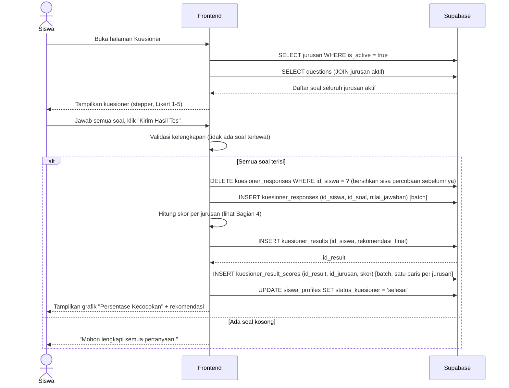

# System Logic: UC-003 Pengisian Kuesioner & Perhitungan Skor

Document Version: v1.0
Use Case ID: UC-003
Status: Draft
Last Updated: 2026-07-05
Project: SAMI-SMK

---

## 1. Overview
Logika sistem untuk pengisian kuesioner minat dan perhitungan skor kecocokan. Sistem mendukung **jurusan dinamis** (jumlah jurusan tidak dibatasi) dan menghitung skor **independen per jurusan** pada rentang 0–100%.

---

## 2. Sequence Diagram



---

## 3. Operasi Sistem (Supabase)

**3.1 Memuat soal jurusan aktif (dinamis)**
```js
const { data: jurusanAktif } = await supabase
  .from('jurusan').select('id, kode, nama').eq('is_active', true);

const { data: soal } = await supabase
  .from('questions')
  .select('id, teks_pertanyaan, id_jurusan')
  .in('id_jurusan', jurusanAktif.map(j => j.id));
```

**3.2 Menyimpan jawaban (delete-then-insert)**
```js
// Bersihkan sisa jawaban agar tidak melanggar unique_siswa_soal
await supabase.from('kuesioner_responses').delete().eq('id_siswa', idSiswa);

await supabase.from('kuesioner_responses').insert(
  jawaban.map(j => ({ id_siswa: idSiswa, id_soal: j.idSoal, nilai_jawaban: j.nilai }))
);
```

**3.3 Menyimpan hasil & skor per jurusan**
```js
const { data: result } = await supabase.from('kuesioner_results')
  .insert({ id_siswa: idSiswa, rekomendasi_final: kodeJurusanTertinggi })
  .select('id').single();

await supabase.from('kuesioner_result_scores').insert(
  skorPerJurusan.map(s => ({ id_result: result.id, id_jurusan: s.idJurusan, skor: s.persen }))
);

await supabase.from('siswa_profiles')
  .update({ status_kuesioner: 'selesai' }).eq('id', idSiswa);
```

---

## 4. Algoritma Perhitungan Skor (inti sistem)

**Prinsip:** setiap jurusan dinilai **mandiri** pada skala 0–100%. Skor antar-jurusan tidak dibagi rata (tidak dijumlahkan menjadi 100), sehingga angka tetap bermakna berapa pun jumlah jurusan.

**Rumus:**
```
Untuk setiap jurusan J:
    soal_J      = seluruh soal dengan id_jurusan = J
    jawaban_J   = nilai jawaban siswa untuk soal_J   (skala Likert 1..5)
    rata_rata_J = jumlah(jawaban_J) / banyak(soal_J)
    persen_J    = (rata_rata_J / 5) x 100            → 0..100 %

rekomendasi_final = jurusan dengan persen tertinggi
```

**Contoh:**
| Jurusan | Jawaban (Likert) | Rata-rata | Persentase |
| --- | --- | --- | --- |
| Multimedia/DKV | 5, 4, 5, 4, 4 | 4.4 | 88% |
| TBSM | 3, 3, 2, 4, 3 | 3.0 | 60% |
| Kuliner | 2, 2, 3, 2, 1 | 2.0 | 40% |

Rekomendasi = **Multimedia/DKV (88%)**.

**Kasus khusus:**
| Kondisi | Penanganan |
| --- | --- |
| Jurusan tanpa soal | Dilewati (tidak dihitung); hindari pembagian dengan nol. |
| Skor tertinggi seri | Dipilih secara konsisten (mis. jurusan terlama berdasarkan `created_at`). |
| Jurusan dinonaktifkan setelah hasil dibuat | Skor lama tetap tersimpan dan tetap ditampilkan pada hasil siswa tersebut. |

---

## 5. Data Flow
| Step | Input | Process | Output |
| --- | --- | --- | --- |
| 1 | — | Muat jurusan aktif + soalnya | Daftar soal dinamis |
| 2 | Jawaban Likert 1–5 | Validasi kelengkapan | Jawaban lengkap |
| 3 | Jawaban | Simpan ke `kuesioner_responses` | Jawaban tersimpan |
| 4 | Jawaban per jurusan | Hitung rata-rata → persentase 0–100 | Skor per jurusan |
| 5 | Skor per jurusan | Simpan `kuesioner_results` + `kuesioner_result_scores` | Hasil & rekomendasi |
| 6 | — | Kunci status kuesioner | `status_kuesioner = 'selesai'` |

---

## 6. Business & Integrity Rules
| Rule | Deskripsi |
| --- | --- |
| Sekali isi | Kuesioner hanya dapat diisi satu kali; rute diblokir setelah `selesai`. |
| Nilai jawaban | Integer 1–5 (Skala Likert). |
| Constraint | `unique_siswa_soal` (id_siswa, id_soal) mencegah jawaban ganda; karena itu digunakan pola delete-then-insert. |
| Skor independen | Persentase per jurusan berdiri sendiri (0–100%), tidak dinormalisasi menjadi total 100. |
| Dinamis | Menambah jurusan/soal langsung memengaruhi kuesioner dan perhitungan berikutnya tanpa perubahan kode. |

---

## 7. Traceability
| User Flow | Requirement | Operasi |
| --- | --- | --- |
| userflow_uc_003.md | F003 | SELECT jurusan/questions; DELETE+INSERT kuesioner_responses; INSERT kuesioner_results & kuesioner_result_scores; UPDATE siswa_profiles |
