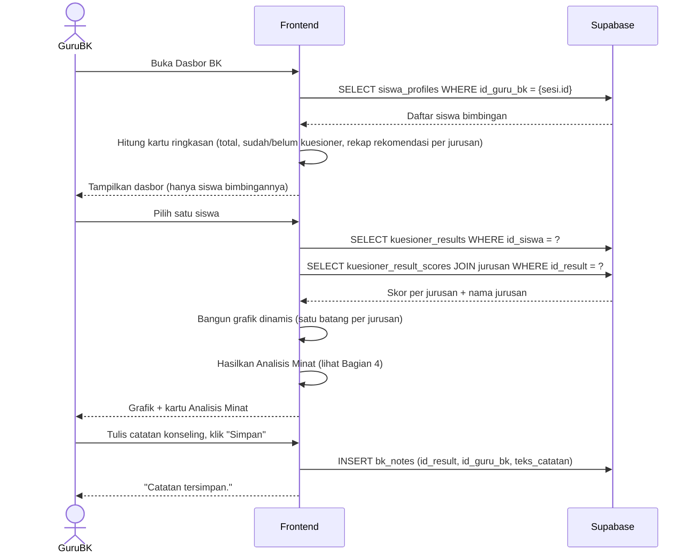

# System Logic: UC-004 Dasbor Guru BK, Analisis Minat & Catatan Konseling

Document Version: v1.0
Use Case ID: UC-004
Status: Draft
Last Updated: 2026-07-05
Project: SAMI-SMK

---

## 1. Overview
Logika sistem untuk dasbor Guru BK: menampilkan siswa bimbingan, grafik hasil dinamis, kartu **Analisis Minat** berbasis aturan, dan penyimpanan catatan konseling.

---

## 2. Sequence Diagram



---

## 3. Operasi Sistem (Supabase)

**3.1 Siswa bimbingan (difilter per Guru BK yang login)**
```js
await supabase.from('siswa_profiles')
  .select('id, nisn, nama_siswa, angkatan_tahun, status_kuesioner')
  .eq('id_guru_bk', sesi.id);
```

**3.2 Hasil & skor per jurusan**
```js
await supabase.from('kuesioner_result_scores')
  .select('skor, jurusan:id_jurusan (id, nama, kode)')
  .eq('id_result', idResult);
```

**3.3 Simpan catatan konseling**
```js
await supabase.from('bk_notes')
  .insert({ id_result: idResult, id_guru_bk: sesi.id, teks_catatan: teks });
```

---

## 4. Algoritma Analisis Minat (berbasis aturan, bukan AI eksternal)

**Masukan:** daftar skor per jurusan siswa (dari `kuesioner_result_scores`, digabung dengan `jurusan.nama`).

**Proses:**
```
urutkan skor dari tertinggi ke terendah
tertinggi   = skor[0]
kedua       = skor[1] (bila ada)
selisih     = tertinggi.persen - kedua.persen

jika selisih besar        → "jelas condong"   ke {tertinggi.nama}
jika selisih sedang       → "cenderung"       ke {tertinggi.nama}
jika selisih sangat kecil → "seimbang"        antara jurusan-jurusan teratas (sebut namanya)
```

**Sifat dinamis:** nama jurusan diambil **dari data**, bukan ditulis di kode. Jurusan baru yang ditambahkan Admin otomatis dapat muncul pada analisis tanpa perubahan kode.

**Keluaran:** narasi singkat + saran tindak lanjut untuk Guru BK, disertai catatan bahwa keputusan akhir tetap pada Guru BK.

**Batasan akses:** kartu Analisis Minat **hanya** tampil untuk peran Guru BK (tidak untuk Siswa maupun Orang Tua).

---

## 5. Data Flow
| Step | Input | Process | Output |
| --- | --- | --- | --- |
| 1 | sesi.id (Guru BK) | Filter `siswa_profiles.id_guru_bk` | Daftar siswa bimbingan |
| 2 | Daftar siswa | Agregasi kartu ringkasan | Total, status, rekap per jurusan |
| 3 | id_result | Ambil skor per jurusan + nama | Data grafik dinamis |
| 4 | Skor per jurusan | Aturan 3 tingkat | Narasi Analisis Minat |
| 5 | Teks catatan | INSERT `bk_notes` | Catatan tersimpan |

---

## 6. Business & Integrity Rules
| Rule | Deskripsi |
| --- | --- |
| Isolasi bimbingan | Guru BK hanya melihat siswa dengan `id_guru_bk` = dirinya, termasuk pada seluruh kartu ringkasan/rekapitulasi. |
| Skor tidak dapat diubah | Guru BK hanya menambah catatan; angka hasil tidak boleh diubah/dihapus. |
| Analisis = alat bantu | Bersifat saran; keputusan akhir tetap pada Guru BK. |
| Dinamis | Grafik dan analisis menyesuaikan jumlah jurusan secara otomatis. |

---

## 7. Traceability
| User Flow | Requirement | Operasi |
| --- | --- | --- |
| userflow_uc_004.md | F004 | SELECT siswa_profiles (filter id_guru_bk); SELECT kuesioner_result_scores JOIN jurusan; INSERT bk_notes |
