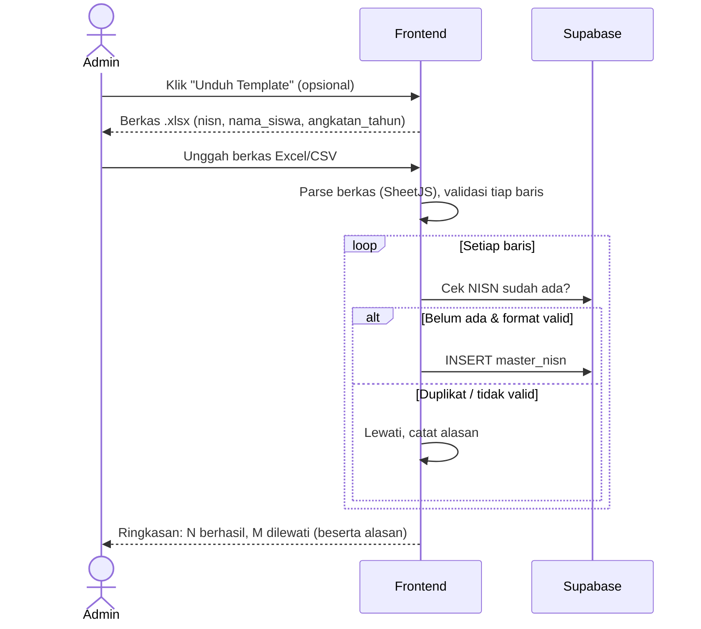
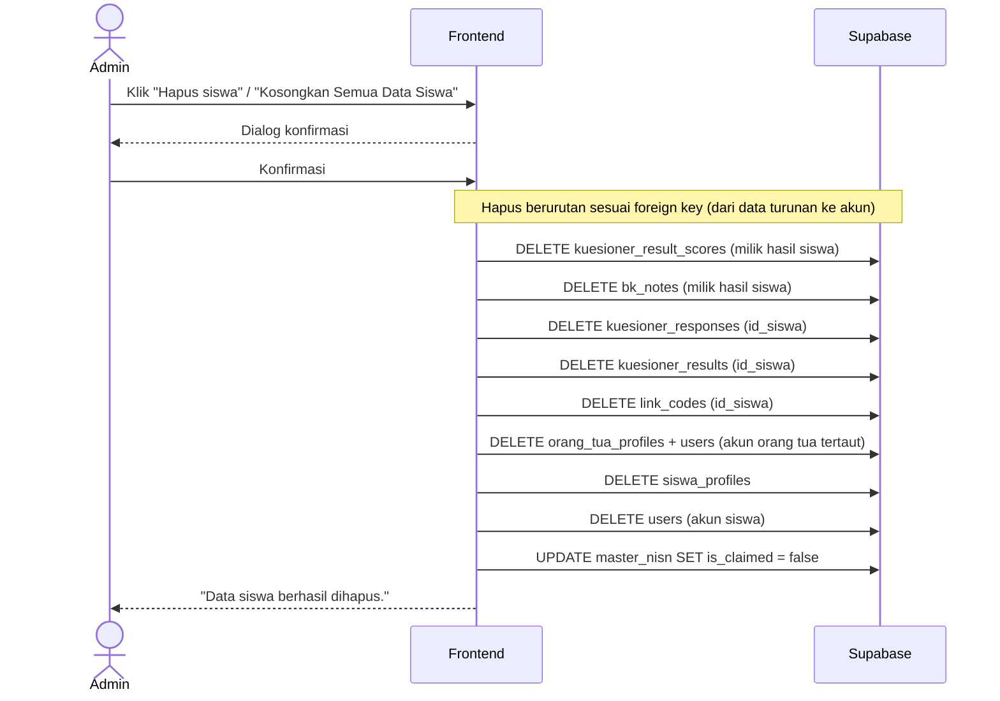

# System Logic: UC-005 Pengelolaan Data Master NISN

Document Version: v1.0
Use Case ID: UC-005
Status: Draft
Last Updated: 2026-07-05
Project: SAMI-SMK

---

## 1. Overview
Logika sistem untuk pengelolaan data master NISN oleh Admin: tambah manual, impor Excel/CSV, hapus, serta **penghapusan siswa yang bersih** (tanpa data yatim).

---

## 2. Sequence Diagram — Impor Excel



---

## 3. Sequence Diagram — Hapus Siswa (bersih)



---

## 4. Operasi Sistem (Supabase)

**4.1 Tambah manual**
```js
await supabase.from('master_nisn').insert({ nisn, nama_siswa, angkatan_tahun });
```

**4.2 Impor massal (setelah parsing berkas)**
```js
await supabase.from('master_nisn').insert(barisValid); // NISN duplikat dilewati sebelum insert
```

**4.3 Urutan penghapusan (wajib, agar tidak melanggar foreign key)**
```
kuesioner_result_scores → bk_notes → kuesioner_responses → kuesioner_results
→ link_codes → orang_tua_profiles (+ users ortu) → siswa_profiles → users (siswa)
→ UPDATE master_nisn.is_claimed = false
```

---

## 5. Business & Integrity Rules
| Rule | Deskripsi |
| --- | --- |
| NISN unik | 10 digit, menjadi kunci verifikasi pendaftaran. |
| Klaim | NISN yang sudah dipakai ditandai `is_claimed = true`. |
| Penghapusan bersih | Seluruh data turunan siswa harus ikut terhapus; tidak boleh menyisakan data yatim (mis. skor tanpa siswa). |
| Konfirmasi | Setiap penghapusan wajib melalui dialog konfirmasi; penghapusan massal memakai konfirmasi ketik-untuk-yakin. |
| Efek lanjutan | Setelah data siswa kosong, jurusan menjadi tidak terpakai sehingga dapat dihapus bersih (lihat UC-007). |

---

## 6. Traceability
| User Flow | Requirement | Operasi |
| --- | --- | --- |
| userflow_uc_005.md | F002 | INSERT/DELETE master_nisn; DELETE berantai data siswa; UPDATE is_claimed |
