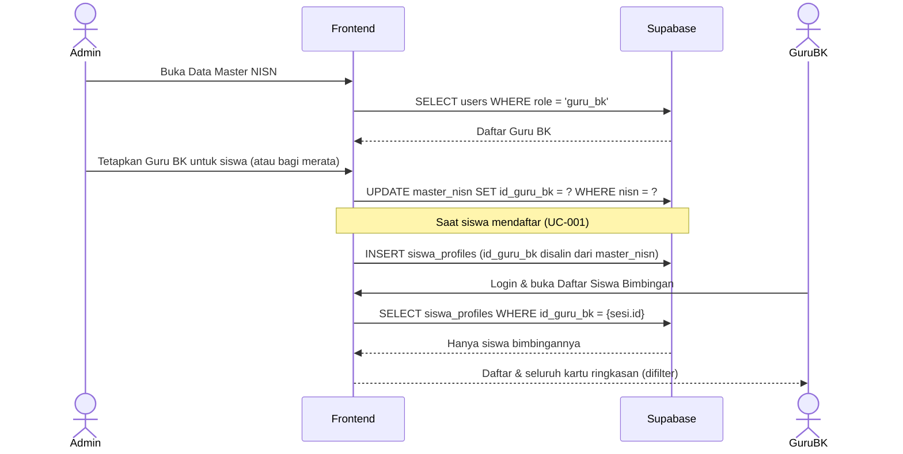

# System Logic: UC-006 Penugasan Siswa ke Guru BK Pembimbing

Document Version: v1.0
Use Case ID: UC-006
Status: Draft
Last Updated: 2026-07-05
Project: SAMI-SMK

---

## 1. Overview
Logika sistem untuk menetapkan Guru BK pembimbing bagi tiap siswa, dan menjamin isolasi data antar-Guru BK.

---

## 2. Sequence Diagram



---

## 3. Operasi Sistem (Supabase)

**3.1 Menetapkan Guru BK pada data master**
```js
await supabase.from('master_nisn').update({ id_guru_bk: idGuruBk }).eq('nisn', nisn);
```

**3.2 Penurunan ke profil siswa (saat pendaftaran)**
```js
// id_guru_bk diambil dari master_nisn lalu disalin
await supabase.from('siswa_profiles').insert({ ..., id_guru_bk });
```

**3.3 Filter data pada seluruh tampilan Guru BK**
```js
await supabase.from('siswa_profiles').select('*').eq('id_guru_bk', sesi.id);
```

---

## 4. Business & Integrity Rules
| Rule | Deskripsi |
| --- | --- |
| Satu pembimbing | Satu siswa memiliki tepat satu Guru BK pembimbing. |
| Sumber kebenaran | Penugasan disimpan pada `master_nisn`, lalu disalin ke `siswa_profiles` saat siswa mendaftar. |
| Isolasi data | Seluruh kueri pada tampilan Guru BK **wajib** difilter `id_guru_bk = sesi.id` — termasuk kartu total siswa, status kuesioner, dan rekapitulasi rekomendasi per jurusan. |
| Konsistensi angka | Bila seorang Guru BK tidak memiliki siswa, seluruh kartu ringkasannya harus bernilai nol (tidak boleh mengambil data Guru BK lain). |

---

## 5. Traceability
| User Flow | Requirement | Operasi |
| --- | --- | --- |
| userflow_uc_006.md | F002, F004 | UPDATE master_nisn.id_guru_bk; SELECT siswa_profiles (filter id_guru_bk) |
