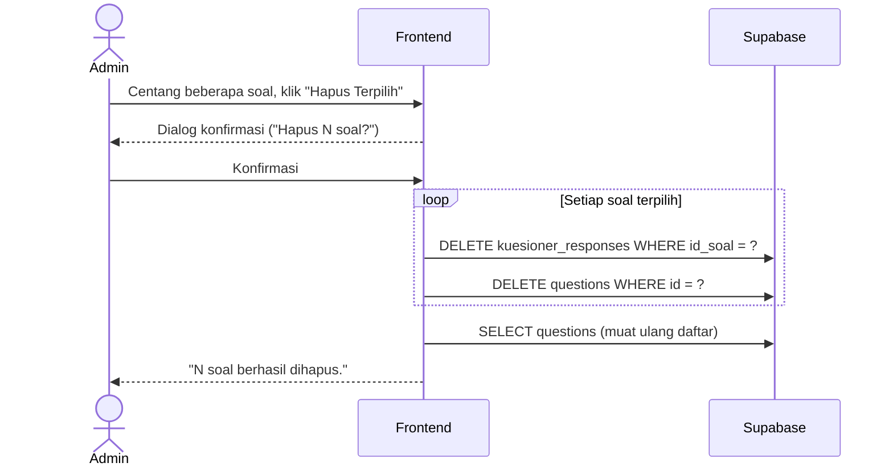

# System Logic: UC-008 Pengelolaan Bank Soal Kuesioner

Document Version: v1.0
Use Case ID: UC-008
Status: Draft
Last Updated: 2026-07-05
Project: SAMI-SMK

---

## 1. Overview
Logika sistem untuk pengelolaan bank soal oleh Admin: tambah/edit, impor Excel, hapus satuan, dan **hapus massal** — termasuk penanganan soal yang sudah memiliki jawaban siswa.

---

## 2. Sequence Diagram — Hapus Soal (satuan & massal)



---

## 3. Operasi Sistem (Supabase)

**3.1 Tambah soal (id dibuat otomatis oleh basis data)**
```js
await supabase.from('questions').insert({
  teks_pertanyaan: teks,
  id_jurusan: idJurusan          // TIDAK mengirim kolom id
});
```

**3.2 Impor massal**
```js
// parse .xlsx (teks_pertanyaan, kode_jurusan)
// petakan kode_jurusan -> jurusan.id (hanya jurusan aktif); baris tanpa padanan dilewati
await supabase.from('questions').insert(barisValid);
```

**3.3 Hapus soal (urutan wajib karena foreign key)**
```js
// 1) hapus jawaban yang mereferensikan soal
await supabase.from('kuesioner_responses').delete().eq('id_soal', idSoal);
// 2) baru hapus soalnya
await supabase.from('questions').delete().eq('id', idSoal);
```

---

## 4. Catatan Teknis Penting

| Isu | Penyebab | Penanganan |
| --- | --- | --- |
| `duplicate key ... questions_pkey` | Data awal (seed) disisipkan dengan `id` eksplisit sehingga sequence auto-increment tidak ikut maju. | Sinkronkan sequence: `SELECT setval(pg_get_serial_sequence('questions','id'), (SELECT COALESCE(MAX(id),0) FROM questions)+1, false);` dan **jangan** mengirim `id` saat insert. |
| `violates foreign key ... kuesioner_responses_id_soal_fkey` | Soal masih direferensikan jawaban siswa. | Hapus `kuesioner_responses` untuk soal tersebut lebih dulu, baru hapus soalnya. |
| Kolom lama `klaster_jurusan` NOT NULL | Peninggalan struktur lama sebelum jurusan dinamis. | Kolom dilonggarkan (nullable); kini soal dikaitkan lewat `id_jurusan`. |

---

## 5. Business & Integrity Rules
| Rule | Deskripsi |
| --- | --- |
| Kaitan jurusan | Setiap soal terkait satu jurusan melalui `id_jurusan` (hanya jurusan aktif yang dapat dipilih). |
| Konfirmasi | Penghapusan satuan maupun massal wajib melalui dialog konfirmasi. |
| Dampak langsung | Perubahan soal langsung memengaruhi kuesioner siswa berikutnya. |
| Perhitungan tetap benar | Skor dihitung dari rata-rata jawaban per jurusan, sehingga tetap sahih berapa pun jumlah soal per jurusan. |

---

## 6. Traceability
| User Flow | Requirement | Operasi |
| --- | --- | --- |
| userflow_uc_008.md | F007 | INSERT/UPDATE questions; DELETE kuesioner_responses lalu questions; INSERT (impor) |
